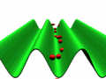

# Analysis of fast nuclear dechanneling in highly bent crystals
<!---->

---

# Introduction
<!-- page_number: true -->
<!-- footer: Nuclear dechanneling analysis - Introduction -->
In order to write a better simulation routine for highly bent (low radius of curvature) crystals, we need to analyze experimental data to discover the relationship between the curvature and the dechanneling of particles out of the crystal planes.

---

# Theory
<!-- footer: Nuclear dechanneling analysis - Theory-->

## Crystal bending

## Electronic dechanneling
Dechanneling caused by scattering with electrons can be approximately described by diffusion theory:

---

# Data 
<!-- footer: Nuclear dechanneling analysis - Data -->
## Types of file:

* .root
* .dat